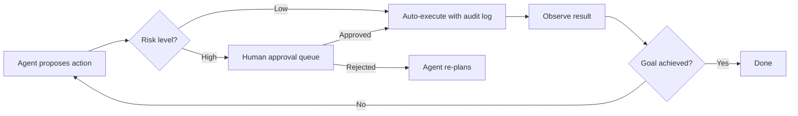
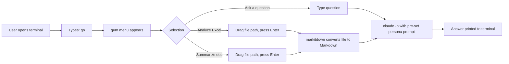

## Overview

Agentic AI is reshaping how knowledge workers interact with everyday office tools. Rather than replacing applications like Excel, PDF readers, Microsoft Access, or PowerPoint, agentic systems act as autonomous co-workers that can plan multi-step tasks, call tools, observe results, and self-correct — all within familiar document formats. The result is a shift from "AI that suggests" to "AI that does": it reads your spreadsheet, queries your database, extracts tables from your PDFs, and generates a deck from your data, with a human reviewing at checkpoints rather than driving every step.

---

> [!review]- Comprehension Review
> - **Comfort Level**: beginner / intermediate / advanced
> - **Feedback**:

## Why Agentic (not just Copilot)

Most embedded AI (Copilot sidebars, formula autocomplete, grammar suggestions) is **single-shot**: you prompt once, get one output, decide what to do with it. The human remains the loop.

**Agentic AI** is architecturally different:

| Dimension | Single-Shot AI | Agentic AI |
|:--|:--|:--|
| Planning | None | Decomposes goal into sub-tasks |
| Tool use | One action | Calls multiple tools in sequence |
| Memory | Stateless | Maintains state across steps |
| Self-correction | None | Observes results, retries on failure |
| Human role | Reviews every output | Reviews at defined checkpoints |

The practical consequence: an agentic Excel agent can read a messy export, detect the schema, clean the data, generate a PivotTable, and write a summary paragraph — as one uninterrupted workflow. A single-shot Copilot can only assist with one step at a time.

---

> [!review]- Comprehension Review
> - **Comfort Level**: beginner / intermediate / advanced
> - **Feedback**:

## Tool Coverage

| Tool | Key Agent Use Cases | Atomic Note |
|:--|:--|:--|
| Excel | Formula generation, data cleaning, anomaly detection, PivotTable creation, MCP-driven analysis | [[Excel-AI-Automation]] |
| PDF | Multi-document RAG, table extraction, form filling, contract review (ADW) | [[PDF-AI-Processing]] |
| Microsoft Access | Natural language to JET SQL, schema documentation, migration planning | [[Access-AI-Querying]] |
| PowerPoint | Outline-to-deck pipelines, data viz agents, design enforcement, MCP servers | [[PowerPoint-AI-Generation]] |
| Terminal parsing (all formats) | markitdown, docling CLI, LibreOffice headless, batch pipelines | [[Terminal-Office-Parsing]] |

---

> [!review]- Comprehension Review
> - **Comfort Level**: beginner / intermediate / advanced
> - **Feedback**:

## Common Patterns Across Tools

### Document-as-Context

The document (file, spreadsheet, PDF, database) is the agent's context: it is parsed, chunked if large, and injected into the model's working memory. The agent reasons over the document rather than asking the user to explain it.

### Action-Confirmation Loop

Low-risk actions (reading data, generating drafts) are automated. High-risk actions (overwriting data, sending outputs externally) require human confirmation.

### Export and Handoff

The agent produces a structured artefact (cleaned `.xlsx`, populated PDF form, `.pptx` file) that is handed to the Office application for final review. The agent never replaces the Office application; it populates it.

---

> [!review]- Comprehension Review
> - **Comfort Level**: beginner / intermediate / advanced
> - **Feedback**:

## Agent Architecture Patterns (Applicable to All Tools)

### ReAct (Reason + Act)

Iterative `Thought → Action → Observation` loop. Best for open-ended tasks where the correct sequence is not known upfront (e.g., exploratory data analysis in Excel).

### Plan-and-Execute

A planner LLM generates the full task graph; cheaper executor models run each step. Useful for large-batch tasks (e.g., processing 500 PDFs).

### Multi-Agent (Specialist Pattern)

An orchestrator delegates to specialist subagents: a schema-reader, a SQL-generator, a QA-validator. Each agent has bounded scope and its own tool set.

---

> [!review]- Comprehension Review
> - **Comfort Level**: beginner / intermediate / advanced
> - **Feedback**:

## Shared Limitations and Risks

- **Data privacy**: Documents often contain PII, trade secrets, or regulated data. See [[Agentic-AI-for-Sensitive-Data]] for isolation patterns.
- **Hallucination in file manipulation**: An agent that writes incorrect data to a file is harder to detect than a chatbot giving a wrong answer. Validation layers are essential.
- **Token budget**: Large files (10MB Excel, 300-page PDF) exceed model context windows. Chunking and summarization strategies are required.
- **Tool fragility**: COM-based automation (xlwings, PowerPoint COM) is brittle in enterprise environments (antivirus, 32-bit mismatches, shared file locks).
- **Audit and reversibility**: Agentic writes should always produce backups or diffs; immutable outputs are preferred where possible.

---

> [!review]- Comprehension Review
> - **Comfort Level**: beginner / intermediate / advanced
> - **Feedback**:

## Personal Deployment Context

**Setup**: Claude Pro subscription (Claude Desktop, claude.ai web, MCP servers, Claude Agent Mode in Excel).

**Target users**: Girlfriend and mother — no coding background, but they do have terminal access and can be guided. The preference is terminal-first agentic workflows, not GUI-only tools. The UX goal is: I engineer the complexity once; they run a single command.

**Design principle**: do not hide the terminal — teach it one command at a time, with scripts that do the rest.

### Guided terminal strategy

Rather than routing them to browser-only SaaS tools, the approach is:

1. I write shell scripts or a `Justfile` that wraps the full pipeline into one memorable command.
2. They run `analyze sales.xlsx` or `summarize email.txt` — the script handles conversion, LLM call, and output.
3. For open-ended Q&A, a gateway alias drops them into an interactive Claude Code session with a pre-written `CLAUDE.md` that sets the persona, scope, and tone appropriate for them.
4. A `gum`-powered menu (`just go` or one alias) lists available tasks in an arrow-key UI for days they forget the command name.

### Terminal tool stack for non-technical users

| Layer | Tool | Why |
|:--|:--|:--|
| File conversion | `markitdown` | One CLI; handles .xlsx, .docx, .pptx, PDF all at once |
| Python tools | `uvx` | No virtualenv, no pip — just `uvx tool args` |
| Task runner | `just` | Memorable `just <task>` commands; self-documenting |
| Menu UI | `gum` (Charmbracelet) | Arrow-key TUI; file picker; spinner |
| LLM interface | `claude -p` (headless) or interactive `claude` | Claude Pro already paid; no extra cost |

### Per-tool recommendations (terminal-first)

| Office Tool | Terminal Approach | Fallback (web) |
|:--|:--|:--|
| Excel | `markitdown data.xlsx \| claude -p "..."` | claude.ai — upload file directly |
| PDF | `markitdown report.pdf \| claude -p "..."` or `docling myfile.pdf` | Google NotebookLM (upload PDFs, ask questions) |
| PowerPoint | `markitdown deck.pptx \| claude -p "..."` to read; `python-pptx` agent to generate | Gamma.app web UI |
| Word | `markitdown doc.docx \| claude -p "..."` or `pandoc doc.docx -o doc.md` | claude.ai — upload .docx |
| Access | `mdbtools` to export tables to CSV, then process CSV | Export to Excel first |

### Claude.ai web (zero-setup fallback)

For claude.ai web with Claude Pro: enable the Analysis tool in account settings. Accepts `.xlsx`, `.docx`, `.pptx`, `.pdf`, CSV, images — up to 30 MB, 20 files per conversation. Claude can also create and export Office files directly. This is the zero-setup starting point before any terminal workflow is set up.

---

> [!review]- Comprehension Review
> - **Comfort Level**: beginner / intermediate / advanced
> - **Feedback**:

## Sources

- [Anthropic: Model Context Protocol](https://www.anthropic.com/news/model-context-protocol)
- [Microsoft Copilot in Excel](https://support.microsoft.com/en-us/office/get-started-with-copilot-in-excel-d7110502-0334-4b4f-a175-a73abdfc118a)
- [LlamaIndex: Agentic Document Workflows](https://www.llamaindex.ai/blog/introducing-agentic-document-workflows)
- [LangChain: SQL Agent](https://docs.langchain.com/oss/python/langchain/sql-agent)

---

## Related Notes

- [[Agentic-AI-for-Sensitive-Data]]
- [[Excel-AI-Automation]]
- [[PDF-AI-Processing]]
- [[Access-AI-Querying]]
- [[PowerPoint-AI-Generation]]
- [[Terminal-Office-Parsing]]
