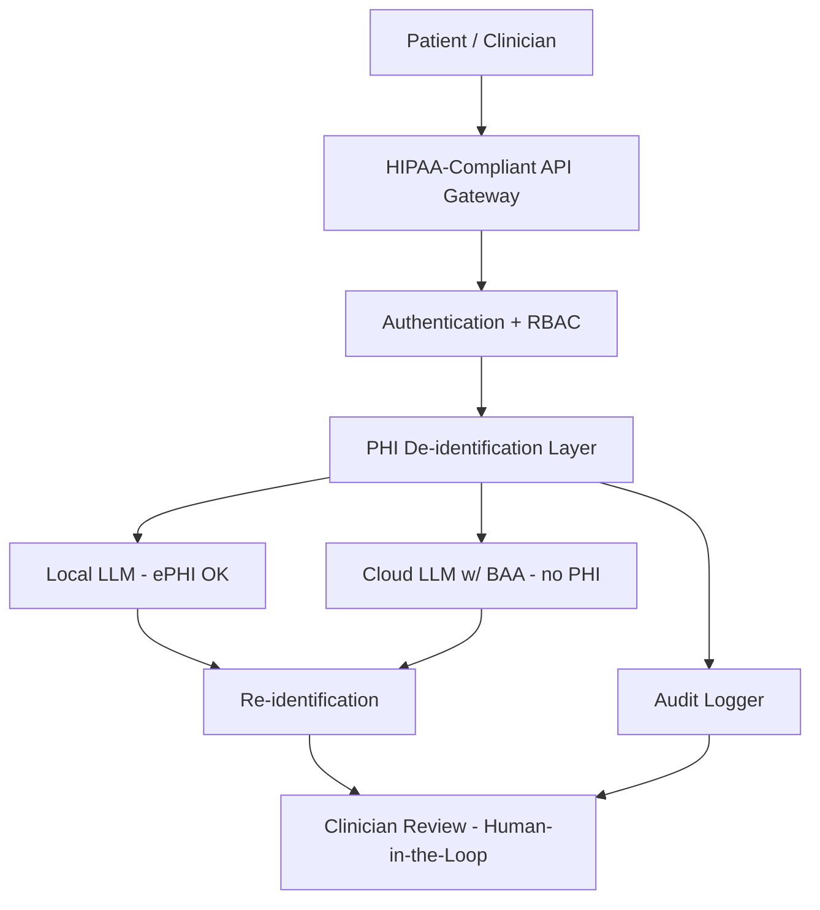
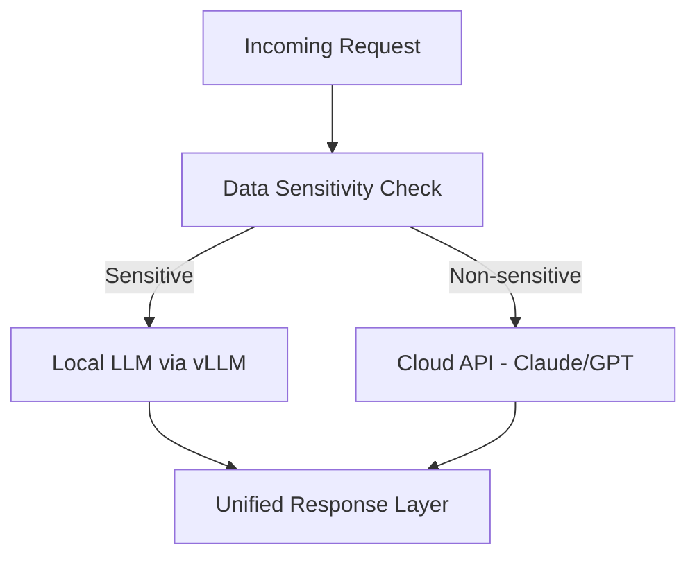
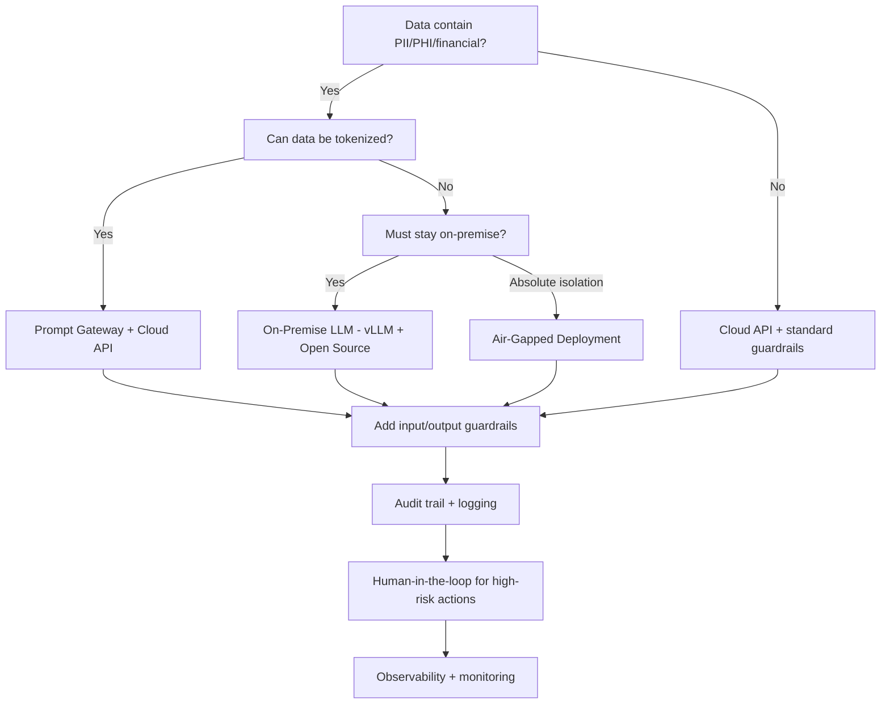

## Overview

Research note investigating agentic AI architectures and design patterns for handling sensitive data in banking, healthcare, and other regulated domains. Covers architectures, isolation patterns, guardrails, compliance frameworks, and Singapore-specific considerations.

---

> [!review]- Comprehension Review
> - **Comfort Level**: beginner / intermediate / advanced
> - **Feedback**:

## 1. Agentic AI Architectures

### What Makes an AI System "Agentic"

- **Tool Use**: Invoke external functions, APIs, databases, code execution
- **Planning**: Decompose complex goals into sequenced sub-tasks
- **Memory**: Maintain state across interactions (short-term + long-term)
- **Autonomy**: Decide actions without step-by-step human instruction
- **Reflection**: Evaluate own outputs and self-correct

### Key Architecture Patterns

#### ReAct (Reasoning + Acting)

Iterative loop: **Thought -> Action -> Observation**. The agent reasons, acts (tool call), observes result, and decides whether to continue. Best for adaptive reasoning, research, debugging.

#### Plan-and-Execute

A "planner" model creates strategy upfront, cheaper "executor" models carry out steps. Can reduce costs up to 90%. Best for well-defined multi-step workflows, batch processing.

#### Multi-Agent Systems

Specialized agents collaborate via an orchestrator. Each agent has a defined role, tools, and scope. Saw 1,445% surge in adoption inquiries Q1 2024 to Q2 2025. Best for complex workflows requiring diverse expertise.

#### Reflection Pattern

Agent critiques its own output and iteratively improves. Often a "critic" agent reviews the "worker" agent's output. Best for quality-critical outputs (code generation, document drafting).

### Frameworks Comparison

| Framework | Approach | Strengths | Learning Curve |
|:--|:--|:--|:--|
| **LangGraph** | Graph-based state machines | Fine-grained control, debuggable | Steep |
| **CrewAI** | Role-based "crews" | Intuitive, beginner-friendly | Low |
| **AutoGen** (Microsoft) | Conversation-driven multi-agent | Human-in-the-loop, async | Medium |
| **Claude Tool Use / MCP** | Protocol-based persistent context | Stateful sessions, standard protocol | Medium |
| **LangChain** | Chain-based composition | Massive ecosystem, integrations | Medium |

### Model Context Protocol (MCP)

Anthropic's MCP is the de-facto standard for connecting agents to tools and data. Maintains persistent context across interactions. Key 2025 features: Tool Search (thousands of tools without consuming context), Programmatic Tool Calling, Tool Use Examples.

---

> [!review]- Comprehension Review
> - **Comfort Level**: beginner / intermediate / advanced
> - **Feedback**:

## 2. Sensitive Data Challenges

### What Makes Sensitive Domains Different

1. **Data cannot leave the perimeter**: Cannot send data to external APIs
2. **Errors have legal consequences**: PII leaks carry regulatory penalties
3. **Audit requirements**: Every interaction must be logged and traceable
4. **Consent management**: Data subjects have rights over their data
5. **Domain expertise required**: Hallucinations in banking/healthcare are dangerous

### Regulatory Landscape

| Regulation | Scope | Key AI Requirements |
|:--|:--|:--|
| **HIPAA** | US healthcare (ePHI) | Encryption, access controls, audit logging, BAAs, human-in-the-loop for clinical decisions |
| **PCI-DSS 4.0** | Payment card data (fully mandatory April 2025) | Real-time redaction, tokenization, least-privilege access |
| **GDPR** | EU personal data | Right to explanation (Art. 22), right to be forgotten, DPIAs, data minimization |
| **PDPA** | Singapore personal data | Consent for AI training, purpose limitation, cross-border transfer controls |

---

> [!review]- Comprehension Review
> - **Comfort Level**: beginner / intermediate / advanced
> - **Feedback**:

## 3. Data Isolation Patterns

### Local-Only Processing

All data stays on organization's hardware. Zero exfiltration risk. GDPR/HIPAA compliant by design.

**Tools**: Ollama (dev/prototyping), vLLM (production, 3.23x faster at 128 concurrent requests), LM Studio (desktop GUI), LocalAI (OpenAI-compatible API)

### Air-Gapped Deployments

Completely isolated, no internet connection. Model weights transferred via secure physical media. Critical for defense, aerospace, finance, healthcare.

**Requirements**: AES-256 encryption at rest/transit, RBAC, offline model updates via signed packages.

### Data Masking and Tokenization (Prompt Gateway Pattern)

```
[User Input with PII] -> [Prompt Gateway] -> [PII Detection] -> [Tokenization] -> [Sanitized Prompt to LLM]
                                                                                            |
[De-tokenized Response] <- [De-tokenization] <------------- [LLM Response] <---------------+
```

**Tokenization approaches**:
- **Deterministic**: Consistent placeholders (`[PERSON_1]`), preserves entity relationships
- **Format-preserving encryption**: Maintains data format while encrypting
- **Synthetic substitution**: Replace with statistically similar synthetic data

**Tools**: Microsoft Presidio, Skyflow LLM Privacy Vault, Protecto

### Recommendations

1. Start with data classification -- map which data is truly sensitive
2. Use vLLM for production, Ollama for development
3. Implement Prompt Gateway even with cloud APIs (defense-in-depth)
4. Deterministic tokenization preserves analytical utility better than random masking

---

> [!review]- Comprehension Review
> - **Comfort Level**: beginner / intermediate / advanced
> - **Feedback**:

## 4. Guardrails and Safety

### Input/Output Filtering

```
[User Input] -> [Input Guardrails] -> [LLM] -> [Output Guardrails] -> [Response]
       |                                                  |
  Prompt injection detection              PII leak detection
  Topic boundary enforcement              Hallucination check
  Toxicity screening                      Factuality validation
```

### PII Detection Tools

| Tool | Type | Best For |
|:--|:--|:--|
| **Microsoft Presidio** | Open-source analyzer + anonymizer | Custom pipelines, multi-language, LLM middleware |
| **AWS Comprehend** | Managed service | AWS-native, configurable thresholds |
| **Google Cloud DLP** | API-based | Structured + unstructured data |
| **Guardrails AI** | Open-source validator library | Composable guardrail pipelines |

### Prompt Injection Prevention

Prompt injection is #1 on OWASP LLM Top 10 (2025). **NVIDIA NeMo Guardrails** blocks 99% of harmful prompts while only blocking 2% of legitimate requests.

### OWASP LLM Top 10 (2025)

1. Prompt Injection
2. Sensitive Information Disclosure
3. Supply Chain Vulnerabilities
4. Data and Model Poisoning
5. Improper Output Handling
6. Excessive Agency
7. System Prompt Leakage
8. Vector and Embedding Weaknesses
9. Misinformation
10. Unbounded Consumption

### Human-in-the-Loop

```
[Agent Action] -> [Risk Assessment] -> High Risk? -> [Human Approval Queue]
                                     -> Low Risk?  -> [Auto-Execute with Logging]
```

Layer guardrails at input, runtime, and output. Never rely on a single defense.

---

> [!review]- Comprehension Review
> - **Comfort Level**: beginner / intermediate / advanced
> - **Feedback**:

## 5. Banking and Fintech AI Use Cases

### Fraud Detection

Real-time transaction monitoring. U.S. Treasury recovered $4B+ in fraud (2024) via ML. Commonwealth Bank cut scam losses nearly in half. PayPal reported 40% reduction in fraud losses.

### KYC/AML

Agentic AI transforming weeks-long processes into hours:
- Document verification (computer vision, tampering detection)
- Risk-based routing (auto-clear low-risk, escalate high-risk)
- Network analysis for money laundering patterns
- Automated SAR generation with human review

### How Banks Deploy AI Safely

- **Deterministic action layers**: LLM understands intent, but actual transfers/changes executed by secure deterministic scripts
- **Tiered autonomy**: Routine queries automated; financial transactions require human approval
- **Data segmentation**: Customer data never sent to external LLMs; only tokenized data leaves perimeter

---

> [!review]- Comprehension Review
> - **Comfort Level**: beginner / intermediate / advanced
> - **Feedback**:

## 6. Healthcare AI Use Cases

### Key Applications

- **Clinical Decision Support**: Differential diagnosis, drug interactions, treatment protocols
- **Patient Intake**: Adaptive questioning, automated form completion, triage
- **Medical Record Summarization**: Condensing histories, generating discharge summaries
- **Appointment Scheduling**: Intelligent scheduling with priority-based allocation

### HIPAA-Compliant Architecture



**Requirements**: Segregated vendor instances, customer-managed encryption keys, BAAs, SOC 2 Type II, HITRUST CSF, data residency controls.

---

> [!review]- Comprehension Review
> - **Comfort Level**: beginner / intermediate / advanced
> - **Feedback**:

## 7. Trust and Audit Patterns

### What to Log

- Full prompt history and model configuration
- Model decisions, outputs, and guardrail interventions
- Retrieval steps (RAG: which documents retrieved)
- Timestamp, user identity, session ID, token usage

### Compliance Audit Trails

- **EU AI Act** (effective August 2026): Comprehensive traceability for high-risk AI
- **NIST AI RMF**: Structured risk management framework
- **GDPR**: Right to explanation, data processing records
- **MAS/HIPAA/PCI-DSS**: Sector-specific audit requirements

### Observability Tools

| Tool | Focus |
|:--|:--|
| **Langfuse** | Open-source LLM observability, tracing, evaluation |
| **LangSmith** | LangChain's hosted tracing and evaluation |
| **Datadog LLM Monitoring** | Enterprise observability |

---

> [!review]- Comprehension Review
> - **Comfort Level**: beginner / intermediate / advanced
> - **Feedback**:

## 8. Open-Source vs Proprietary Models

### When to Use Local (Open-Source)

Data that must never leave the network, air-gapped environments, high-volume workloads, fine-tuning on domain data, data residency requirements.

**Leading models (2025)**: Llama 4 (Meta), Qwen 3 (Alibaba), DeepSeek R1, Mistral Large, Gemma 2 (Google). The capability gap with proprietary models has substantially closed.

### When to Use Cloud APIs (Proprietary)

Cutting-edge capability, variable workloads (pay-per-token), rapid prototyping, access to latest improvements.

### Hybrid Approach (Recommended)



Route sensitive data to local models, non-sensitive tasks to cloud APIs for maximum capability.

### Cost Comparison

| Factor | Local/Open-Source | Cloud API |
|:--|:--|:--|
| Upfront cost | High ($10K-$200K+ GPU) | None |
| Per-query cost | Electricity only | Per-token pricing |
| Break-even | ~6-12 months at high volume | N/A (ongoing) |
| Maintenance | Internal team | Vendor-managed |

---

> [!review]- Comprehension Review
> - **Comfort Level**: beginner / intermediate / advanced
> - **Feedback**:

## 9. Singapore-Specific Context

### MAS AI Risk Management Guidelines (November 2025)

- **Scope**: All financial institutions in Singapore
- **AI Inventories**: Mandatory cataloging with materiality assessments
- **Implementation**: 12-month transition from issuance
- All AI agents in financial services must be registered and assessed

### PDPA for AI (March 2024 Advisory Guidelines)

- Consent required for AI training on personal data
- Purpose limitation: processing must align with collection purpose
- Cross-border transfers must meet PDPA requirements

### National AI Strategy 2.0 (NAIS 2.0)

SGD 1 billion+ over five years:
- **SEA-LION**: National multimodal LLM for Southeast Asian languages
- **AI Verify**: Government-developed testing toolkit (bias, explainability, robustness)
- **ISAGO**: Practical governance framework

### Singapore vs EU Approach

| Aspect | Singapore | EU AI Act |
|:--|:--|:--|
| Approach | Principles-based, sector-specific | Risk-based, horizontal regulation |
| Enforcement | Sector regulators (MAS, MOH, PDPC) | Centralized AI Office |
| AI Testing | AI Verify (voluntary) | Mandatory conformity assessments |
| Focus | Innovation + governance balance | Consumer protection + risk mitigation |

---

> [!review]- Comprehension Review
> - **Comfort Level**: beginner / intermediate / advanced
> - **Feedback**:

## Architecture Decision Framework



### Key Takeaways

1. No single pattern fits all -- combine based on sensitivity and regulation
2. The Prompt Gateway is universal -- sanitize data before it reaches the LLM
3. Human-in-the-loop is not optional in healthcare and high-value finance
4. Open-source models have reached parity for many tasks
5. Singapore's approach is pragmatic -- sector-specific with voluntary testing tools
6. Audit everything from day one -- EU AI Act, MAS, HIPAA all require it
7. Layer defenses at input, runtime, and output

> [!review]- Comprehension Review
> - **Comfort Level**: beginner / intermediate / advanced
> - **Feedback**:

## Sources

- [Google Cloud: Design Patterns for Agentic AI](https://docs.google.com/architecture/choose-design-pattern-agentic-ai-system)
- [Anthropic: Model Context Protocol](https://www.anthropic.com/news/model-context-protocol)
- [OWASP: LLM Top 10 2025](https://genai.owasp.org/llmrisk/llm01-prompt-injection/)
- [Microsoft Presidio - GitHub](https://github.com/microsoft/presidio)
- [NVIDIA NeMo Guardrails - GitHub](https://github.com/NVIDIA-NeMo/Guardrails)
- [MAS: AI Risk Management Guidelines](https://www.mas.gov.sg/news/media-releases/2025/mas-guidelines-for-artificial-intelligence-risk-management)
- [McKinsey: Agentic AI in Banking KYC/AML](https://www.mckinsey.com/capabilities/risk-and-resilience/our-insights/how-agentic-ai-can-change-the-way-banks-fight-financial-crime)
- [Langfuse: LLM Security and Guardrails](https://langfuse.com/docs/security-and-guardrails)
- [Singapore NAIS 2.0](https://www.smartnation.gov.sg/initiatives/artificial-intelligence/)
- [PCI SSC: AI Principles for Payment Security](https://blog.pcisecuritystandards.org/ai-principles-securing-the-use-of-ai-in-payment-environments)

## Related Notes

- [[AutoConnect]] -- Fleet management system handling vehicle telemetry (potential sensitive data domain)
