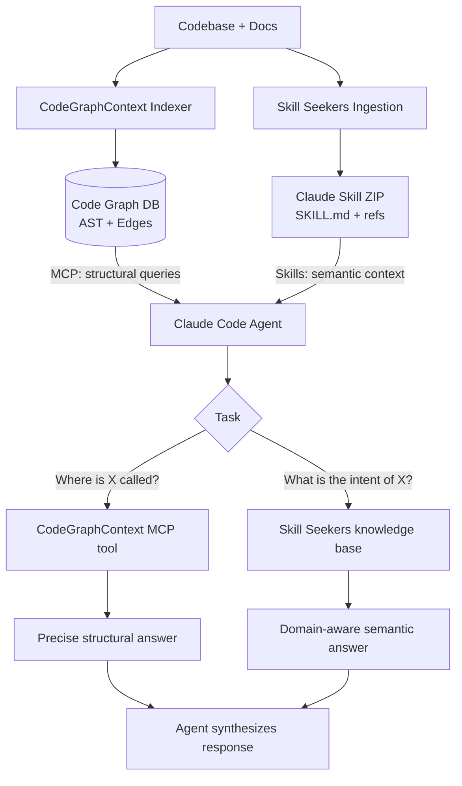
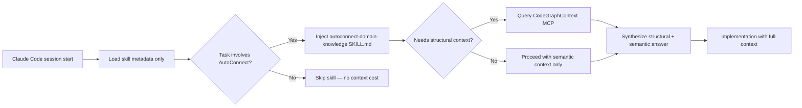

## Summary

Skill Seekers is an open-source documentation-to-skills preprocessor that ingests documentation sites, GitHub repositories, PDFs, and local codebases and emits structured AI skills and RAG-ready knowledge assets in 16+ output formats. It directly addresses the semantic context gap in agentic AI: while structural tools like CodeGraphContext expose call graphs and dependency edges, they carry no domain meaning — Skill Seekers captures the *why* and *how* encoded in prose, comments, and architecture decision records that AST analysis cannot surface. Together the two tools give an agent both the topological map of a codebase and the semantic intent behind it. Skill Seekers is distributed as a PyPI package (`pip install skill-seekers`), licensed under MIT, and ships with an MCP server providing 26 tools for autonomous knowledge-base preparation by the agent itself.

## Table of Contents

- [[#What is Skill Seekers]]
- [[#Ingestion Pipeline]]
- [[#Output Format and Integration]]
- [[#Pricing and Access Model]]
- [[#Incremental Re-Ingestion and CI/CD]]
- [[#Structural vs Semantic Context]]
- [[#Comparison with Adjacent Tools]]
- [[#AutoConnect Integration Pattern]]
- [[#Related Notes]]

## What is Skill Seekers

Skill Seekers (v3.0.0 as of 2026) is the "universal documentation preprocessor for the AI ecosystem" — the author's own framing. Its core value proposition is converting any unstructured knowledge corpus into a target-specific artifact that an LLM agent can consume without requiring the user to write prompts, chunking strategies, or embedding pipelines by hand.

The tool originated as a documentation scraper (v1.x) targeting Claude AI skills specifically, then expanded through v2.x to multi-source ingestion and multi-platform output, and reached its current architecture in v3.0.0 where the MCP server enables agents to autonomously manage their own knowledge bases — a form of meta-cognition where the agent prepares its own context before beginning the primary task.

### Problem Space

The core problem: LLM agents operating on large codebases or documentation corpora suffer from two distinct knowledge deficits.

1. **Structural blindness**: the agent does not know how modules interconnect — which functions call which, what classes inherit from what. This is CodeGraphContext's domain.
2. **Semantic blindness**: the agent does not know *why* design decisions were made, what the intended contracts of APIs are, or what known failure modes exist. This is encoded in documentation, docstrings, architecture decision records (ADRs), and issue trackers — and requires ingestion, not static analysis.

Skill Seekers solves deficit 2. It turns prose-heavy knowledge sources into machine-consumable artifacts that slot into Claude Code's skills system, RAG pipelines, or vector databases.

### Repository and Identity

- GitHub: `yusufkaraaslan/Skill_Seekers` (9,716 stars, 967 forks as of early 2026)
- Website: `skillseekersweb.com`
- PyPI: `skill-seekers`
- License: MIT (fully open-source, self-hostable)
- Implementation: Python 3.10–3.13, 58,512 lines of code, 1,852 passing tests across 100 test files

> [!review]- Comprehension Review
> - **Comfort Level**: beginner / intermediate / advanced
> - **Feedback**:

## Ingestion Pipeline

The ingestion pipeline handles four source categories and applies source-type-specific analysis before feeding into a shared packaging layer.

### Source Types

**1. Documentation Sites**

Supports any HTML-rendered documentation platform: Docusaurus, GitBook, ReadTheDocs, MkDocs, custom static sites. The scraper performs recursive crawl with pagination handling, respects `robots.txt`, extracts main content while discarding navigation chrome, and preserves code block fencing (critical for skill quality — code blocks stripped of their backtick context degrade rapidly in RAG retrieval).

**2. GitHub Repositories (Three-Stream Analysis)**

v2.6.0 introduced the Three-Stream Analysis model, which partitions a GitHub repo into three independent analysis streams rather than treating it as a flat file corpus:

| Stream | Content | Analysis Method |
|:--|:--|:--|
| Code | Source files in 27+ languages | AST parsing, design pattern detection |
| Docs | README, CONTRIBUTING, `docs/*.md`, inline docstrings | Semantic chunking, Markdown parsing |
| Insights | Issue labels, star/fork counts, known problems | Metadata extraction, community signal |

The `UnifiedCodebaseAnalyzer` produces a structured result object: `code_analysis` (C3.1 design patterns, C3.2 example counts), `github_docs` (processed documentation), and `github_insights` (repository metadata). This separation prevents high-frequency documentation prose from diluting low-frequency but high-precision code patterns in the same embedding space.

AST-based design pattern detection covers: Singleton, Factory, Observer, Strategy, Decorator, Builder, Adapter, Command, Template Method, and Chain of Responsibility across 9 languages (Python, JavaScript, TypeScript, C++, C, C#, Go, Rust, Java). The remaining 18+ languages in the 27-language support set receive file-level chunking without pattern detection.

**3. PDF Files**

OCR-backed extraction handles scanned documents. The pipeline extracts text, runs layout analysis to distinguish body text from headers and captions, and applies semantic chunking. Tables are extracted as structured Markdown where possible rather than flat prose, which improves downstream RAG precision for tabular data.

**4. Local Codebases**

Operates on filesystem paths without requiring a GitHub remote. Applies the same AST analysis as the GitHub stream. Useful for private, proprietary, or in-development codebases that are not publicly accessible. Conflict detection between local documentation and implementation is available here — if a docstring describes a function signature that no longer matches the actual signature, the tool flags it.

### Conflict Detection

A first-class feature across all source types: `detect_conflicts` scans for discrepancies between documented behavior and implemented behavior. This is operationally important for maturing codebases where docs drift from code. The output includes a conflict manifest that can be fed into an agent as a separate knowledge artifact — a "known drift" index that lets the agent reason about documentation reliability.

> [!review]- Comprehension Review
> - **Comfort Level**: beginner / intermediate / advanced
> - **Feedback**:

## Output Format and Integration

Skill Seekers separates ingestion from packaging. After extraction and analysis, content is held in an intermediate representation that can be serialized to 16 distinct target formats across three categories.

### Output Format Table

| Category | Supported Targets |
|:--|:--|
| AI Skills | Claude (ZIP + SKILL.md), Gemini (tar.gz), OpenAI / Custom GPT (ZIP) |
| RAG / Vector DB | LangChain Documents (JSON), LlamaIndex TextNodes (JSON), Chroma, FAISS, Haystack, Qdrant, Weaviate |
| AI Coding Tools | Cursor (`.cursorrules` + docs), Windsurf, Cline, Continue.dev |
| Generic | Markdown (universal), JSON |

### Claude Skill Format

The Claude-target output produces a ZIP archive containing a skill directory. The critical file is `SKILL.md`, which follows the Claude Agent Skills specification:

```
my-skill/
├── SKILL.md          # Required: YAML frontmatter + instruction body
├── references/       # Optional: supplementary documentation
│   └── api-guide.md
├── scripts/          # Optional: executable code Claude can invoke
└── assets/           # Optional: templates, examples
```

`SKILL.md` structure:

```markdown
---
name: autoconnect-domain-knowledge
description: >
  Domain knowledge for the AutoConnect autonomous vehicle interface system.
  Invoke when working on CAN bus integration, fleet management APIs,
  or HMI component architecture decisions.
allowed-tools:
  - Read
  - Bash
---

## Domain Context
[... 500+ lines of extracted and structured domain knowledge ...]

## Known API Contracts
[...]

## Architecture Decision Records
[...]
```

At Claude Code startup, only `name` and `description` are pre-loaded for all skills in scope. The full `SKILL.md` body is injected into context only when Claude determines the skill is relevant to the current task — a lazy-loading mechanism that avoids burning context on irrelevant knowledge.

Skills are installed into Claude Code by:
1. Placing the unzipped skill directory under `.claude/skills/` in the project root (project-scoped), or
2. Uploading the ZIP via the Claude web interface under Customize > Skills (account-scoped)
3. Using the MCP `install_skill` tool for automated deployment from within an agent session

### RAG Format Output

For vector database targets, Skill Seekers emits pre-chunked documents that preserve code block boundaries and section hierarchy. For LangChain, output is a JSON array of `Document` objects with `page_content` and `metadata` fields. For LlamaIndex, output is a JSON array of `TextNode` objects with `text`, `metadata`, and `relationships`. Chunk boundaries are determined semantically (header boundaries, paragraph breaks, code block delimiters) rather than fixed token counts, which reduces context fragmentation at retrieval time.

### MCP Integration (26 Tools)

The MCP server (`pip install skill-seekers[mcp]`) exposes 26 tools organized into functional groups:

| Group | Tools | Count |
|:--|:--|:--|
| Core | `list_configs`, `generate_config`, `validate_config`, `estimate_pages`, `scrape_docs`, `package_skill`, `upload_skill`, `enhance_skill`, `install_skill` | 9 |
| Extended | `scrape_github`, `scrape_pdf`, `unified_scrape`, `merge_sources`, `detect_conflicts`, `add_config_source`, `fetch_config`, `list_config_sources`, `remove_config_source`, `split_config` | 10 |
| Vector DB | `export_to_chroma`, `export_to_weaviate`, `export_to_faiss`, `export_to_qdrant` | 4 |
| Cloud | `cloud_upload`, `cloud_download`, `cloud_list` | 3 |

Transport: `stdio` mode for Claude Code and VS Code + Cline; `HTTP` mode for Cursor, Windsurf, IntelliJ IDEA.

The MCP server registration in `~/.claude/settings.json`:

```json
{
  "mcpServers": {
    "skill-seekers": {
      "command": "python",
      "args": ["-m", "skill_seekers.mcp_server"],
      "env": {}
    }
  }
}
```

This enables the agent to autonomously run `scrape_docs`, `package_skill`, and `install_skill` within a session — the agent prepares its own knowledge base as a first step before beginning implementation work.

> [!review]- Comprehension Review
> - **Comfort Level**: beginner / intermediate / advanced
> - **Feedback**:

## Pricing and Access Model

Skill Seekers is fully open-source under the MIT License with no SaaS tier, no freemium gate, and no hosted service component. There is no pricing.

### Distribution Model

| Component | Mechanism |
|:--|:--|
| Core package | `pip install skill-seekers` (PyPI) |
| MCP extension | `pip install skill-seekers[mcp]` |
| uv (faster) | `uvx skill-seekers` |
| Source | `git clone github.com/yusufkaraaslan/Skill_Seekers` |
| Docker | Official container image available |

The cloud storage tools (`cloud_upload`, `cloud_download`) connect to user-owned cloud accounts (S3, Google Cloud Storage, Azure Blob Storage) — Skill Seekers does not operate cloud infrastructure. There is no central skill registry or hosted knowledge store; all processing is local.

### Processing Time

End-to-end skill generation runs 15–45 minutes depending on source size and target format count. This is a one-time or periodic cost (see [[#Incremental Re-Ingestion and CI/CD]]), not a per-query latency cost. The vector DB exports and RAG pipeline outputs are generated once and queried at inference time without re-running Skill Seekers.

### Practical Cost Boundary

Because Skill Seekers itself is free and self-hosted, the only cost is compute time (negligible on a developer workstation) and optionally LLM API calls if the `enhance_skill` tool is used to run an LLM pass over extracted content for quality improvement. `enhance_skill` uses the configured LLM endpoint — Claude API, OpenAI API, or a local model — and incurs whatever token costs that endpoint charges.

> [!review]- Comprehension Review
> - **Comfort Level**: beginner / intermediate / advanced
> - **Feedback**:

## Incremental Re-Ingestion and CI/CD

### Update Detection Strategy

Skill Seekers does not implement fine-grained change detection at the document or chunk level (no content hash diffing per-page). The standard pattern is full re-ingestion on a schedule or trigger, which runs in 15–45 minutes. For codebases with fast-changing documentation, this is acceptable; for very large corpora, selective source re-scraping using `split_config` to target changed source sections is the recommended approach.

The `merge_sources` tool with `merge_mode` can combine a freshly scraped documentation source with a previously scraped GitHub source without re-running the full pipeline, enabling partial updates where only one source has changed.

### Conflict Manifest Drift

The conflict detection system (`detect_conflicts`) is particularly valuable for incremental workflows: run it after each re-ingestion to produce a diff of new documentation-implementation discrepancies. Feeding this manifest into an agent session gives it an up-to-date "what we know is stale" index, which is more actionable than raw re-ingested content alone.

### GitHub Actions Workflow

Skill Seekers ships a reference GitHub Actions workflow for automated re-ingestion:

```yaml
# .github/workflows/update-skills.yml
name: Update AI Skills
on:
  push:
    paths:
      - 'docs/**'
      - 'src/**'
      - '*.md'
  schedule:
    - cron: '0 2 * * 0'  # Weekly Sunday 2am UTC

jobs:
  regenerate:
    runs-on: ubuntu-latest
    steps:
      - uses: actions/checkout@v4
      - run: pip install skill-seekers
      - run: skill-seekers scrape --config .skill-seekers/config.yaml
      - run: skill-seekers package --target claude --output skills/
      - uses: actions/upload-artifact@v4
        with:
          name: claude-skills
          path: skills/
```

Path filters on `docs/**` and `src/**` ensure the workflow only triggers on content changes, not CI infrastructure changes. The artifact upload makes the freshly packaged skill available for download or subsequent deployment steps.

### Vector Store Refresh

For Chroma, FAISS, Qdrant, and Weaviate targets, re-ingestion produces a new index that replaces the previous one. Vector store refresh is not incremental at the embedding level — the full collection is rebuilt. For FAISS (flat index file), this is a file replacement. For Chroma and Qdrant (server-based), the collection is dropped and recreated, which requires a brief maintenance window. Weaviate supports class-level delete + re-import for zero-downtime rotation if two classes are used alternately.

> [!review]- Comprehension Review
> - **Comfort Level**: beginner / intermediate / advanced
> - **Feedback**:

## Structural vs Semantic Context

This is the core design rationale for pairing Skill Seekers with CodeGraphContext in an agentic coding session.

### The Two Context Dimensions

Context delivered to a coding agent can be characterized on two axes:

| Dimension | Type | What It Answers | Example Tool |
|:--|:--|:--|:--|
| Structural | Graph / topological | "What calls what? What inherits from what? What imports what?" | CodeGraphContext |
| Semantic | Prose / intentional | "Why was this designed this way? What are the invariants? What are known failure modes?" | Skill Seekers |

Neither dimension is a substitute for the other. A call graph tells an agent that `FleetManager.syncVehicleState()` calls `CANBusAdapter.pollFrame()`. It does not tell the agent that `pollFrame()` must never be called from the main thread due to a hardware timing constraint documented in the integration guide. That constraint is semantic — encoded in documentation — and invisible to AST or graph analysis.

Conversely, a Skill Seekers-generated knowledge base tells the agent about threading constraints and API contracts, but it cannot tell the agent which other modules would be affected by changing `pollFrame()`'s signature. That requires graph traversal.

### CodeGraphContext Architecture

CodeGraphContext (MCP server + CLI, `codegraphcontext` on PyPI) indexes a local codebase into a graph database and exposes it via 12+ MCP tools. Key capabilities:

- Callers/callees of any function
- Inheritance hierarchies, class dependency chains
- Import graphs across the entire project
- Live file watching with automatic graph updates (`cgc watch`)
- Query language for multi-hop traversal ("what calls X that is called by Y")

The graph is built from AST extraction across 12 supported languages, stored in a local graph database (no cloud dependency), and queried at agent request time. Latency per query is low (milliseconds) because the graph is pre-indexed, not computed on demand.

### Complementary Deployment Pattern



In practice: Claude Code loads the Skill Seekers skill at session start (lazy-loaded when the skill description matches task context). When the agent needs to understand a component's purpose, it reads from the skill knowledge base. When it needs to understand what would break if that component changed, it queries CodeGraphContext's call graph.

### Research Validation

A 2026 paper on graph-structured dependency navigation in agentic coding ("The Navigation Paradox in Large-Context Agentic Coding", arxiv 2602.20048) found that for tasks where relevant files are determined by code structure rather than semantic similarity, retrieval-based approaches (embedding search) provide zero benefit over random selection, while graph navigation achieves 99.4% accuracy. This confirms that structural and semantic retrieval are not competing approaches but cover non-overlapping problem classes. For AutoConnect's architecture — a multi-module system with CAN bus adapters, fleet APIs, and HMI layers — both dimensions are independently necessary.

> [!review]- Comprehension Review
> - **Comfort Level**: beginner / intermediate / advanced
> - **Feedback**:

## Comparison with Adjacent Tools

| Dimension | Skill Seekers | LlamaIndex Ingestion | LangChain Loaders | Context7 (MCP) | CodeGraphContext |
|:--|:--|:--|:--|:--|:--|
| Primary output | Claude Skills, RAG, vector DB | LlamaIndex index | LangChain Documents | Live doc query via MCP | Code graph DB |
| Source types | Docs sites, GitHub, PDF, local codebase | Files, web, DB, APIs | Files, web, DB | Curated library docs | Local codebase only |
| Claude Code integration | Native skills + MCP server | Manual wiring required | Manual wiring required | MCP native | MCP native |
| Conflict detection | Yes (docs vs implementation) | No | No | No | Partial (call graph inconsistency) |
| CI/CD support | GitHub Actions reference workflow | Manual | Manual | N/A (live query) | Live file watch |
| Self-hosted | Yes (fully local) | Yes | Yes | No (managed service) | Yes |
| Semantic content | Yes (prose, ADRs, docstrings) | Yes | Yes | Yes (library docs) | No (structure only) |
| Structural content | Partial (AST patterns only) | No | No | No | Yes (full graph) |
| License | MIT | MIT | MIT | Proprietary / managed | MIT |

Context7 is worth distinguishing specifically: it provides live query access to curated, maintained library documentation via MCP, which is well-suited for third-party library reference (e.g., "what is the signature of `useEffect`?"). Skill Seekers is better suited for first-party domain knowledge and private codebases where the docs are not curated in Context7's database. The two are complementary: Context7 for external library semantics, Skill Seekers for internal domain semantics.

> [!review]- Comprehension Review
> - **Comfort Level**: beginner / intermediate / advanced
> - **Feedback**:

## AutoConnect Integration Pattern

This section documents the intended deployment of Skill Seekers for AutoConnect within Claude Code sessions.

### Knowledge Sources to Ingest

| Source | Type | Content Value |
|:--|:--|:--|
| AutoConnect repo (`/home/kiriketsuki/dev/AutoConnect`) | Local codebase | Component architecture, API contracts, design patterns |
| Architecture decision records (ADRs) | Markdown docs | Design rationale, constraint history |
| HMI design system CSS (`hex-geo-design-system.css`) | Local file | Token structure, naming conventions, component semantics |
| CAN bus integration documentation | PDF / Markdown | Protocol constraints, timing requirements, hardware limits |
| Fleet API specifications | Docs site / Markdown | Endpoint contracts, authentication patterns, error codes |

### Proposed Skill Configuration

```yaml
# .skill-seekers/autoconnect.yaml
sources:
  - type: local_codebase
    path: /home/kiriketsuki/dev/AutoConnect
    languages: [typescript, javascript, css]
  - type: local_docs
    path: /home/kiriketsuki/dev/AutoConnect/docs
    include: ["**/*.md", "**/*.pdf"]
output:
  target: claude
  skill_name: autoconnect-domain-knowledge
  description: >
    Domain knowledge for AutoConnect autonomous vehicle interface system.
    Covers HMI architecture, CAN bus integration, fleet API contracts,
    design token system, and component patterns. Invoke when working on
    any AutoConnect component or integration task.
  enhance: false  # Skip LLM enhancement pass to avoid API cost on first run
```

### Session Architecture



This architecture keeps per-session context costs low: the Skill Seekers content is only injected when relevant, and CodeGraphContext queries are per-request. Neither tool burns context budget on tasks unrelated to AutoConnect.

> [!review]- Comprehension Review
> - **Comfort Level**: beginner / intermediate / advanced
> - **Feedback**:

## Sources

- [Skill Seekers: AI Skills & RAG Toolkit](https://skillseekersweb.com/)
- [GitHub: yusufkaraaslan/Skill_Seekers](https://github.com/yusufkaraaslan/Skill_Seekers)
- [Skill Seekers v3.0.0 Dev.to Release Post](https://dev.to/yusufkaraaslan/skill-seekers-v300-the-universal-data-preprocessor-for-ai-systems-5fao)
- [Skill Seekers Overview Docs](https://skillseekersweb.com/docs/getting-started/overview/)
- [Claude Code: Extend Claude with Skills](https://code.claude.com/docs/en/skills)
- [GitHub: anthropics/skills](https://github.com/anthropics/skills)
- [MCP Market: Skill Seeker](https://mcpmarket.com/server/skill-seeker)
- [GitHub: CodeGraphContext/CodeGraphContext](https://github.com/CodeGraphContext/CodeGraphContext)
- [The Navigation Paradox in Large-Context Agentic Coding (arXiv 2602.20048)](https://arxiv.org/html/2602.20048v1)
- [Context Engineering for Agents — LangChain Blog](https://blog.langchain.com/context-engineering-for-agents/)
- [Is RAG Dead? Rise of Context Engineering — Towards Data Science](https://towardsdatascience.com/beyond-rag/)

## Related Notes

- [[Agentic-AI-for-Office-Productivity]]
- [[Agentic-AI-for-Sensitive-Data]]

---
*Authored by: Clault KiperS 4.6*
